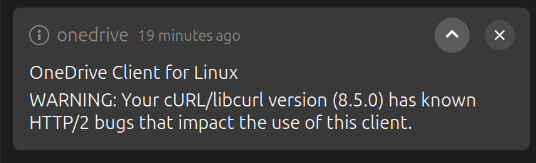

Created: 2025-8-24
---

# Switching from Windows to Ubuntu

I'm now pretty comfortable in Ubuntu 24.04 and am enjoying it a lot.

Below is a small guide (to myself) on alternatives and switching from Windows.

With Pewdiepie's new Linux psyopping, this may be useful to new people taking the leap. Maybe.

By far the biggest issue is everything just "crashes" all the time, Vscode, Cryptomator etc and it asks to send a crash report. The applications still work, so no idea what's going on.

Another issue is twice now I've booted with only 1 monitor working (I usually have 2). Very strange.

## Bitlocker/Encryption

I believe both Windows and Mac have really good encryption defaults, not the case on Ubuntu.

Right now TPM backed full disk encryption is [experimental on 25.10](https://discourse.ubuntu.com/t/ubuntu-desktop-25-10-the-questing-quokka-roadmap/61159). We await, for now one has to type 2 passwords to log in if you want encryption UX like bitlocker.

With the current installer wizard, I don't believe it sets up 2nd drive unlocking on boot, so you need to mess with `fstab` and stuffs I believe, which is quite spooky.

Nvm: Quite easy to set up auto mount on login via Gnome Disk Utility, click the cog.

## Onedrive

Currently it appears [abraunegg's onedrive](https://github.com/abraunegg/onedrive) is the easiest onedrive solution. You will need to edit a config to [set up](https://github.com/abraunegg/onedrive/blob/b4179d1f27ea8a3800f003b12fe3a8c6a89e7a80/docs/usage.md#compatibility-with-obsidian) Obsidian. Apparently Obsidian saves every keystroke and is quite bad for your drive's lifespan. 

You will also see a warning upon every login that [Curl has bugs](https://github.com/abraunegg/onedrive/discussions/2997) due to Ubuntu/Debian shipping a crappy version, and that we should petition Ubuntu to fix things. Thanks Canonical



I suspect I may be moving away from Onedrive in the future and a simpler Google Drive client may be on the play in future.

## Docker

Docker Desktop requires some steps to log in:
https://docs.docker.com/desktop/setup/sign-in/#credentials-management-for-linux-users

You should use docker engine though:

https://docs.docker.com/engine/install/ubuntu/
https://docs.docker.com/engine/install/linux-postinstall/#configure-docker-to-start-on-boot-with-systemd

## Immich

Docker has a problem with traversing fuse mounted directories (Cryptomator)

Thus External Libraries fail if you are adding a docker volume to a Fuse directory as root has no access.

You need to do 2 things:
- Update /etc/fuse.conf and uncomment `allow_other`
- In the Cryptomator mount options add `-oallow_root` as Docker runs as root

You can now add the volume as expected.

Noticable this problem didn't occur with docker desktop.

## Cryptomator

With cloud storage, I like to encrypt the files that go in the cloud as well.

Cryptomator is available, but I always have trouble with AppImages (I wish there was an inbuilt AppImage handler) so instead I go with their PPA for auto updates as well. I don't think AppImage does auto updates.

The biggest issue is that snaps can't access the default mount location, so you will have to edit the default path. [See this discussion](https://github.com/cryptomator/cryptomator/discussions/3922) for details.

Logging out (not locking) appears to not mount the FUSE volumes that cryptomator has which breaks Cryptomator on start so I have this as a script to unnmount running on Gnome's Startup Applications

```bash
#!/usr/bin/env bash

fusermount -uz /home/$USERNAME/Cryptomator/$VAULT1 2>/dev/null || true
fusermount -uz /home/$USERNAME/Cryptomator/$VAULT2 2>/dev/null || true
cryptomator
```

## Voidtool's Everything

[Voidtool's everything](https://www.voidtools.com/) is a super duper useful tool on Windows for instant search of your whole filestylem. Useful for devs trying to find all their configuration files and stuff.

[fsearch](https://github.com/cboxdoerfer/fsearch) is available as a PPA but it should be pretty safe, and was made to be an Everything alternative.

## Steam

Honestly beautiful work. May need to explicitly set the Proton version for certain games to help them continue to work. Elden Ring Neightreign FPS was dreadful though so cutting edge is a no go. Prepare to be a paitent gamer.

## Remote Desktop/Tailscale

Use Remote Login, not Remote Desktop for autoscaling resolution. This requires you to log out of your instance (CTRL + SHIFT + L) instead of lock (CTRL + L)

Tailscale is a godsend albeit with a mild learning curve with setting up permissions. It appears to launch before login so it must be a system wide installation. Windows works seamlessly to remote into Ubuntu AND my trackpad shortcut to middle click actually works. Only huge bug I notice is huuge FPS drop about 5 minutes into the session, which my be alleviated by enabling the exit node?

Tailscale also allows easy vscode SSH and Tunneling if I wanted a lighter connection. It also works seemlessly with devcontainers, (you don't need to install docker on your client). Only concern is you cannot configure a password.

Remoting allows me to keep my 5 year old Surface Laptop 3 being useful. Developing with Rust is too heavy for it. 

If you set the username to be the same as your usual host's username. The client will only ever see a black screen upon remote connection.

https://code.visualstudio.com/remote/advancedcontainers/develop-remote-host#_connect-using-the-remote-ssh-extension

## Installing Applications

How I choose which method to install an application:

I tend to prefer the author's listed method where I'm hoping for a Snap, then a PPA. I'd prefer using a web app than downloading a tool via the terminal generally.

Downsides of the other ones.
- Flatpak: Weird UX of 2 different app managers
- AppImage: Annoying to setup the `.desktop` service (no GUI) and sometimes broken icons
- .deb: No auto updates

## Shortcuts

Had to add some shortcuts to gnome settings GUI

- Win + E: Open file explorer
- Win + T: Open terminal
- Win + Shift + S: Snipping Tool/Screenshotter

I actually themed my temrinal to look like Window's CMD

## Aliases

```bash
# I seriously don't remember the commands to update everything, but Ubuntu does this regularly by itself so this is uneeded
alias updateall='apt-get update && sudo apt-get upgrade && sudo apt-get dist-upgrade'

# Open the file explorer inside this directory
alias openhere='nautilus .'

# Sometimes I need to see if my files are actually syncing (they usually are)
alias onedrivelogs='journalctl --user-unit=onedrive -f'

# Rebuilt the PC so needed a quick check.
alias cputemps="paste <(cat /sys/class/thermal/thermal_zone*/type) <(cat /sys/class/thermal/thermal_zone*/temp) | column -s $'\t' -t | sed 's/\(.\)..$/.\1°C/'"


alias diskspace="du -xhd1 /home/$USERNAME | sort -hr"
```


